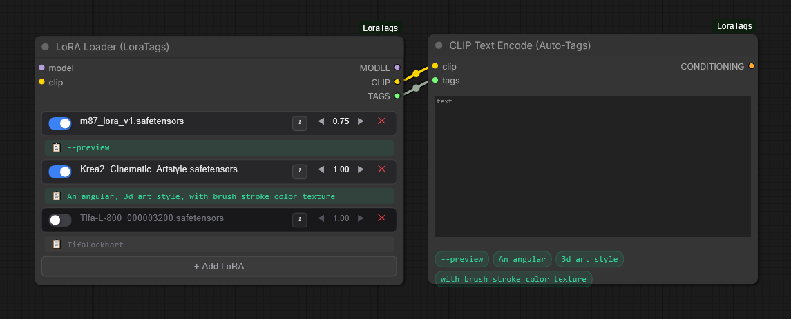

# ComfyUI-LoraTags 🏷️


**ComfyUI-LoraTags** is a powerful, sleek, and highly optimized LoRA loader for ComfyUI. It overhauls the standard LoRA loading experience by introducing a modern tag management system, automated Civitai metadata fetching, and seamless multi-LoRA stacking—all contained within a single, beautifully designed custom node.



---

## ✨ Key Features

### 1. 📚 Infinite LoRA Stacking
Keep your workflows clean. Instead of daisy-chaining multiple standard LoRA loaders, OpenLoraTags allows you to stack as many LoRAs as you need inside a single node. Easily toggle them on/off, adjust strengths, or delete them with a single click.

### 2. 🌐 Automated Civitai Integration
Click the **`i`** (Info) button on any LoRA to open the sleek Tag Manager Modal. The plugin calculates the SHA256 hash of your `.safetensors` file and securely pings the Civitai API to fetch:
* The official Model Name.
* The original Trained Trigger Words.
* Up to 4 preview images.
* A direct ↗ URL link to the model's webpage.

### 3. 🧠 Master Database Tag Manager
No more relying on `.txt` companion files cluttering your hard drive. All tags are saved to a centralized, organized `lora_master_tags.json` file inside the plugin folder. 
* **Locked Tags (Green Bubbles):** Tags automatically retrieved from Civitai.
* **Custom Tags (Blue Bubbles):** Tags you manually type in. Add, edit, or remove these at will.

### 4. 🔗 Auto-Tagging CLIP Text Encoder (NEW)
Automatically route all your active LoRA trigger words directly into your prompt! By connecting the `TAGS` output to the custom **CLIP Text Encode (Auto-Tags)** node, your saved triggers are seamlessly stitched onto the end of your prompt. The node dynamically displays your active tags as beautiful, responsive bubbles right on the canvas.

### 5. 📋 1-Click Clipboard Copying
Prefer manual prompting? Your saved trigger words are displayed right on the ComfyUI canvas beneath your selected LoRA. Simply click the `📋` icon, and the tags are instantly copied to your system clipboard, ready to be pasted.

### 6. 🎨 Modern Canvas UI
Built with a custom HTML5 Canvas drawing engine, this node completely bypasses the clunky default LiteGraph UI. It features:
* Smooth iOS-style toggle switches.
* Glassmorphism elements and semi-transparent borders.
* Minimalist typography and icon design.

---

## 📦 Installation

### Method 1: ComfyUI Manager (Coming Soon)
*Once approved by the ComfyUI Manager repository, you will be able to search for `ComfyUI-LoraTags` in the custom nodes list and click install.*

### Method 2: Git Clone (Recommended)
1. Open your terminal or command prompt.
2. Navigate to your ComfyUI `custom_nodes` directory:
   ```bash
   cd ComfyUI/custom_nodes/
